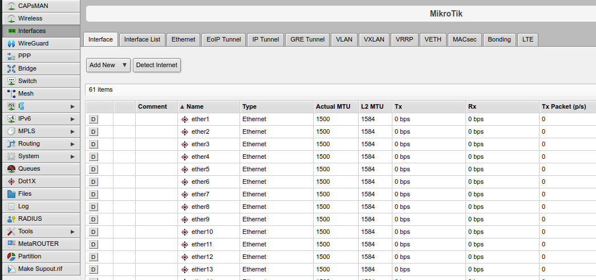
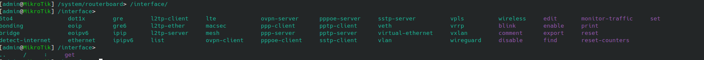

# Configuration d'un switch Mikrotik

- [Configuration d'un switch Mikrotik](#configuration-dun-switch-mikrotik)
  - [Principes](#principes)
  - [Modèle de switch :](#modèle-de-switch-)
  - [Nommage des ports :](#nommage-des-ports-)
  - [Interface web](#interface-web)
    - [Exemple : configurer un port du switch avec un VLAN](#exemple--configurer-un-port-du-switch-avec-un-vlan)
    - [Exemple : créer un agrégat LACP](#exemple--créer-un-agrégat-lacp)
  - [SSH](#ssh)
  - [Port console](#port-console)
    - [Liste des commandes](#liste-des-commandes)
    - [Exemple : configurer un port du switch avec un VLAN](#exemple--configurer-un-port-du-switch-avec-un-vlan-1)
    - [Exemple : créer un agrégat LACP](#exemple--créer-un-agrégat-lacp-1)
    - [Réinitialiser la configuration du switch](#réinitialiser-la-configuration-du-switch)


## Principes

- les switches sont configurés en "live", toute modification est appliquée dès le retour à la ligne en CLI, ou dès le clic sur appliquer /OK sur l'interface web
- pas de double configuration startup / running : la configuration s'enregistre automatiquement


## Modèle de switch :

CRS354-48G-4S+2Q+RM

- CRS : gamme Cloud Router Switch (switches L2+, avec OS RouterOS)
- 3 : génération 3 (génération de chip de switching)
- 54 : 54 ports en tout (hors out of band)
- 48G : 48 ports RJ45 1Gbps non POE
- 4S+ : 4 ports SFP+ (10 Gbps)
- 2Q+ : 2 ports QSFP+ (40 Gbps)
- RM : Rack Mountable, au format 19 pouces/1U et livré avec des oreilles de fixation


## Nommage des ports :

- ether1 à ether48 : ports 1G RJ45 (ports pairs en bas, ports impairs en haut, comme les anciens TPLink)
- ether49 : port de management (sous le port console tout à droite), ne pas utiliser sauf pour le management hors bande (PC en direct sur le switch, uniquement pour gérer le switch)
- sfp-sfpplus1 à sfp-sfpplus4 : ports SFP/SFP+ (1 Gbps ou 10 Gbps)
- qsfpplus1-1 à qsfpplus1-4 et qsfpplus2-1 à qsfpplus2-4 : ports QSFP+ (40 Gbps). Ces ports peuvent être "channelized" (on peut séparer le 40G en 4*10G avec les bons câbles et les bonnes configs pour brancher 4 serveurs sur 1 port).

## Interface web

Par défaut :
- IP : 192.168.88.1
- user : admin
- pas de mot de passe



Les fonctions les plus utiles sont :
- Menu Interfaces : gestion des paramètres physiques (speed, duplex, description sur les interfaces, MTU), création d'agrégats (bonding) et
- Menu Bridge : gestion des paramètres de niveau 2 : VLANs tagged / untagged, PVID sur les ports, spanning tree
- Menu IP (et IPv6) : gestion des paramètres de niveau 3 : adresses IP / DHCP, routage statique, gestion des services réseau type DNS/SSH/SNMP/HTTP/HTTPS...
- Menu system : configuration NTP, gestion des users, upgrade OS / firmware

### Exemple : configurer un port du switch avec un VLAN

1. Identifier le port physique avec le type de port (RJ45, SFP+, QSFP+) et son numéro
2. Dans le menu `Interfaces` => onglet `Interface` et cliquer sur le port à configurer. Cocher la case `enabled` pour activer le port et entrer un `comment` (qui sera utilisé comme IfDescr SNMP) si besoin, avant de cliquer sur OK. 
   1. Si besoin de paramètres physiques spécifiques (désactiver l'auto-négociation, forcer une speed/duplex, modifier la MTU) c'est ici qu'il faut les modifier
3. Si c'est la première fois qu'on configure un VLAN sur le switch alors aller dans le menu `Bridge` => onglet `Bridge`, cliquer sur le bridge (qui doit s'appeler `bridge1`) et dans la section `VLAN` cocher la case `VLAN filtering`. Si ce n'est pas la première fois alors la case est très probablement déjà cochée.
4. Dans le  menu `Bridge` => onglet `VLANs` chercher votre VLAN dans la liste et cliquer dessus (ou cliquer sur `Add New`). Suivant le besoin cliquer sur la petite flêche qui pointe vers le bas sur la ligne `Tagged` ou `Untagged` : cela rajoute une liste déroulante qui permet d'ajouter un port. Choisir le bon port et cliquer sur OK.
5. Refaire l'étape 4 pour tous les VLANs à ajouter si il y en a plusieurs.
6. Dans le  menu `Bridge` => onglet `Ports` cliquer sur le port à configurer, et dans la section `VLAN` configurer le PVID (VLAN attribué aux trames sans tag 802.1q) et les Frame Types (admit all autorise les trames avec et sans tag VLAN, donc cela doit fonctionner dans tous les cas).
7. Dans le  menu `Bridge` => onglet `Hosts` se trouve la table de commutation du switch. Si le port est branché et que l'équipement en face communique, alors des adresses MAC devraient apparaître sur le port concerné, avec le VLAN ID concerné.

### Exemple : créer un agrégat LACP

1. Identifier les ports à utiliser (prendre deux ports du même type)
2. Dans le menu `Interfaces` => onglet `Interface` et cliquer sur le port à configurer. Cocher la case `enabled` pour activer le port et entrer un `comment` (qui sera utilisé comme IfDescr SNMP) si besoin, avant de cliquer sur OK. 
   1. Faire cette étape pour tous les ports de l'agrégat
   2. Si besoin de paramètres physiques spécifiques (désactiver l'auto-négociation, forcer une speed/duplex, modifier la MTU) c'est ici qu'il faut les modifier, mais il faut que speed / duplex et auto-négociation soient identique entre les deux
3. Dans le menu `Interfaces` => onglet `Bonding` cliquer sur `Add New`. Dans la section `Bonding` de la nouvelle page ajouter les interfaces enfants sur la ligne `slaves` et choisir le mode (802.3ad pour LACP, balance-xor pour LAG passif avec load-balancing en fonction des adresses MAC ou IP).
4. Dans la liste `Transmit Hash Policy` choisir la clé utilisée pour le load balancing (adresses MAC, adresses MAC + IP, IP + port). Choisir le `LACP rate` (30 s = slow, 1 s = fast) et cliquer sur OK
5. Configurer le port `bonding1` comme un port classique (PVID, VLANs).


## SSH

Voir la section `Port console` car la CLI SSH est identique à celle du port console.

## Port console

Par défaut :
- câble DB9-RJ-45 habituel (type Cisco, TP-Link, Juniper, ...)
- baud rate : 115200 bps
- 8 bits data
- pas de parité
- 1 bit de stop
- pas de flow control
- user : admin
- pas de mot de passe (le prompt demandera de créer un mot de passe)


La CLI est organisée de manière hiérarchique, comme un système Linux. 

Le prompt :

```
[admin@MikroTik] /system/routerboard>
# => [USER@NOM_DU_SWITCH] /chemin/dans/larborescence> votre_commande
```

Pour descendre dans l'arborescence :

```
[admin@MikroTik] > /system/routerboard/ 
# on descend :
[admin@MikroTik] /system/routerboard> 

```

Pour revenir à la racine :

```
[admin@MikroTik] /system/routerboard> /
# on remonte :
[admin@MikroTik] > 

```

Pour remonter d'un niveau :
```
[admin@MikroTik] /system/routerboard> ../
[admin@MikroTik] /system> 
```

Pour descendre en relatif (sans repartir de la racine) :
```
[admin@MikroTik] /system> routerboard/
[admin@MikroTik] /system/routerboard> 

```



Un double appui sur la touche TAB donne toutes les commandes valides (suivant l'endroit où on se trouve) :
- en vert les sous-dossiers
- en violet les commandes pour voir/modifier la configuration

### Liste des commandes

https://help.mikrotik.com/docs/display/ROS/Command+Line+Interface


- print : voir la liste des entrées avec des infos en live (exemple : `/interface/print` affiche la liste des interfaces avec des infos de base, et un flag 'R' pour les interfaces up)
- export : voir la configuration avec les commandes à utiliser pour la mettre en place (faire cette commande à la racine - `/export` - permet de sauvegarder toute la configuration facilement).
- add : ajouter une entrée (exemple : `/interface/bonding/add slaves=ether31,ether32 comment=LACP_FW lacp-rate=1sec mode=802.3ad` pour ajouter un agrégat LACP).
- edit : modifier un paramètre  (exemple : `/interface/ethernet/edit ether41 comment` ). Un éditeur de texte s'ouvre pour modifier la valeur (CTRL+O pour fermer l'éditeur en sauvegardant)
- set : modifier un paramètre de manière plus simple (exemple : `/interface/ethernet/set ether41 comment="commentaire 2" `)

Il est possible de modifier plusieurs entrées en même temps (exemple : `/interface/ethernet/set ether42,ether43 comment="commentaire 3" ` )

### Exemple : configurer un port du switch avec un VLAN

1. Identifier le port physique avec le type de port (RJ45, SFP+, QSFP+) et son numéro
2. Configuration de base :

```
[admin@MikroTik] > /interface/ethernet/              
[admin@MikroTik] /interface/ethernet> enable ether41                    
[admin@MikroTik] /interface/ethernet> set ether41 comment="nouveau port"

```
Si besoin de paramètres spécifiques :

```
[admin@MikroTik] /interface/ethernet> set ether41 auto-negotiation=no speed=100Mbps full-duplex=yes
```

3. Vérification que le bridge a le filtrage VLAN :

```
[admin@MikroTik] /interface/ethernet> /interface/bridge/print 
``` 

4. Ajout d'un VLAN et ajout des ports sur les VLANs

```
[admin@MikroTik] > /interface/bridge/vlan/
[admin@MikroTik] /interface/bridge/vlan> add bridge=bridge  vlan-ids=12 untagged=ether41 comment="VLAN_production_12"

```

Pour modifier un VLAN existant :

```
[admin@MikroTik] /interface/bridge/vlan> print
Flags: D - DYNAMIC
Columns: BRIDGE, VLAN-IDS, CURRENT-UNTAGGED
#   BRIDGE  VLAN-IDS  CURRENT-UNTAGGED
0 D bridge         1  bridge          
                      ether49         
;;; VLAN_production_12
1   bridge        12 
```

Récupérer le n° de ligne (0 pour le VLAN 1, 1 pour le VLAN 12) et pour modifier les ports untagged :

```
edit 1 untagged
```

Ajouter le nouveau port à la suite (avec une virgule) et faire CTRL+O pour enregistrer et quitter

Pour changer la liste des VLANs taggués :

```
edit 1 tagged
```

Ajouter le nouveau port à la suite (avec une virgule) et faire CTRL+O pour enregistrer et quitter

5. Gestion du PVID :
 
```
[admin@MikroTik] > /interface/bridge/port
[admin@MikroTik] /interface/bridge/port> print
```

Récupérer le n° de ligne (0 pour le ether1, 2 pour ether2, ...) puis :

```
[admin@MikroTik] /interface/bridge/port> set numbers=16 pvid=12

```

Pour vérifier :

```
[admin@MikroTik] /interface/bridge/port> print 
Flags: I - INACTIVE; H - HW-OFFLOAD
Columns: INTERFACE, BRIDGE, HW, PVID, PRIORITY, PATH-COST, INTERNAL-PATH-COST, HORIZON
 #    INTERFACE     BRIDGE  HW   PVID  PRIORITY  PATH-COST  INTERNAL-PATH-COST  HORIZON
;;; defconf
 0 IH ether1        bridge  yes     1  0x80             10                  10  none   
;;; defconf
 1 IH ether2        bridge  yes     1  0x80             10                  10  none   

[...]

;;; defconf
16 IH ether17       bridge  yes    12  0x80             10                  10  none  
```

Sinon de manière plus rapide :

```
[admin@MikroTik] > /interface/bridge/port/set [find interface=ether17] pvid=12
```

6. Voir la table MAC du switch

```
/interface/bridge/host/print 
```

### Exemple : créer un agrégat LACP

1. Identifier le port physique avec le type de port (RJ45, SFP+, QSFP+) et son numéro
2. Configuration de base :

```
[admin@MikroTik] > /interface/ethernet/              
[admin@MikroTik] /interface/ethernet> enable ether41,ether42                    
[admin@MikroTik] /interface/ethernet> set ether41,ether42 comment="LACP FW"

```
Si besoin de paramètres spécifiques :

```
[admin@MikroTik] /interface/ethernet> set ether41,ether42 auto-negotiation=no speed=100Mbps full-duplex=yes
```

3. Ajout de l'agrégat :

```
/interface/bonding/add slaves=ether41,ether42 comment="LACP FW" name=bonding1 mode=802.3ad lacp-rate=1sec transmit-hash-policy=layer-3-and-4
/interface/bridge/port/add bridge=bridge interface=bonding1 pvid=40
```

En cas d'erreur `failure: ether41 already in bridge` (erreur liée au fait qu'une interface ne peut pas être en même temps membre d'un agrégat et membre d'un bridge) :

```
/interface/bridge/port/remove [ find interface=ether41 ] 
```


4. Configurer le port `bonding1` comme un port classique (PVID, VLANs).


### Réinitialiser la configuration du switch

Pour le faire en gardant les users :

```
/system/reset-configuration keep-users=yes
```

Sinon :

```
/system/reset-configuration
```
